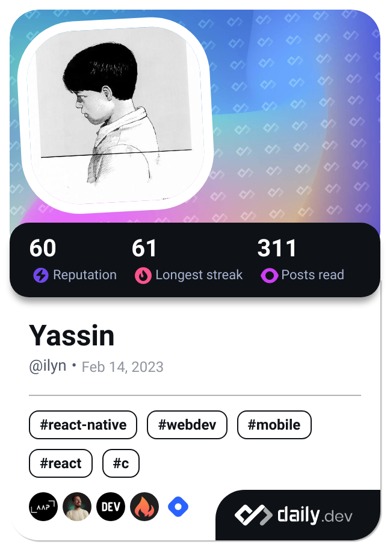

### Ilyn / Yassin
### French software developer

Developing is fun

## Skills

### Frontend

### Backend
   

### Other
    

## Misc
| Stats | Languages | Dev Card |
|:---:|:---:|:---:|
|  |  |  |
